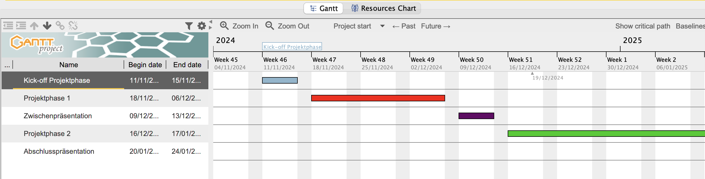
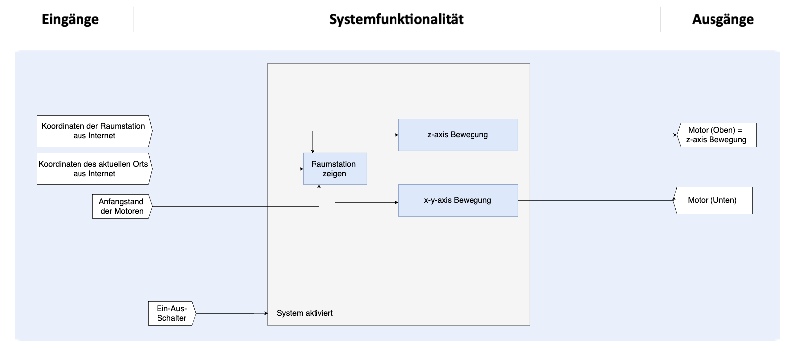

# Satellite Tracker mit STM32

Dieses Projekt entstand im Rahmen meines Studiums an der RWTH Aachen. Ziel war es, einen Roboter zu bauen, der autonom die Position eines Satellites (in unserem die International Space Station) verfolgen.

## Funktionen
- Firmware in C für STM32
- Projektplanung mit Gantt
- Berechnung von Azimut und Elevation, Koordinatenumrechnung

## Verwendete Technologien
- STM32CubeIDE
- Logic Analyzer, CoolTerm
- Python-API
- Git

## Herausforderungen
- Fehlersuche bei Signalverlusten
- Austausch defekter Komponenten
- Zeitmanagement & Teamkoordination

## Medien – Satellite Tracker

  

    <h3 style="margin-top:12px;">Projektplanung mit Gantt</h3>
    
Übersicht über die zeitliche Planung des Projekts, inklusive Meilensteine und Verantwortlichkeiten.

    
  

  

    <h3 style="margin-top:12px;">Systemdiagramm</h3>
    
Darstellung der Systemarchitektur: Datenfluss zwischen Python-API, STM32-Mikrocontroller und Robotikkomponenten.

    
  

  

    <h3 style="margin-top:12px;">Aufbau des Trackers</h3>
    
Der Roboterarm besteht aus zwei Motoren – der obere Motor steuert die Elevation, der untere die Azimutrichtung. Positionsdaten der ISS werden lokal über eine Python-API abgerufen.

    
  

  

    <h3 style="margin-top:12px;">Demonstration & Verifikation</h3>
    
Im Testlauf folgte der Roboter der Position der ISS. Die Ausrichtung des Arms wurde visuell mit einer Sternbeobachtungs-App überprüft und bestätigt.

    
  

